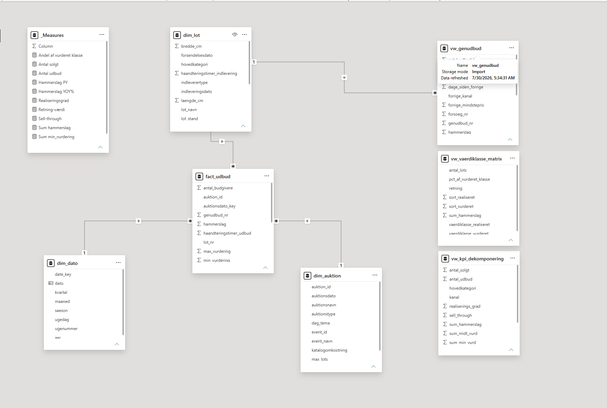
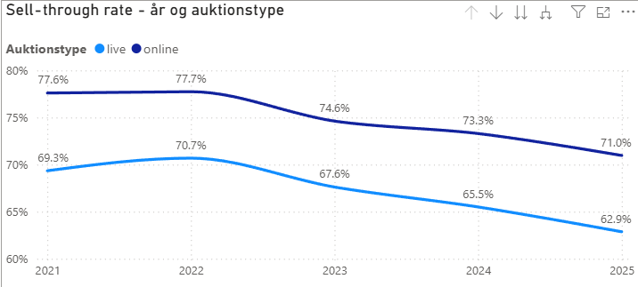
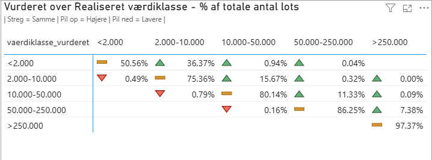
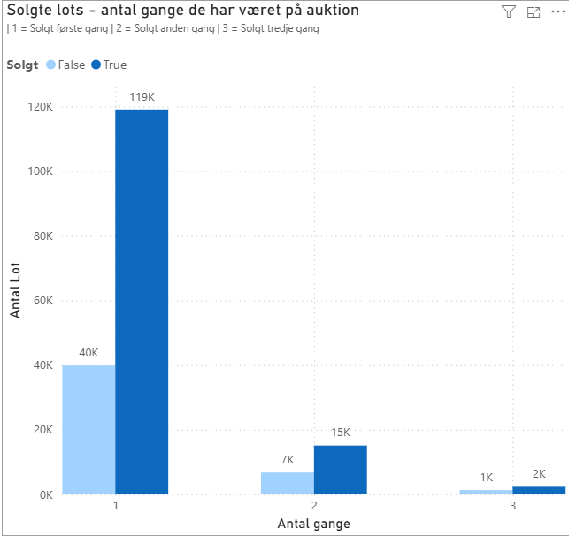

# Auktionsdata – SQL & Power BI

End-to-end analyseprojekt, der demonstrerer hele kæden fra rå data til interaktivt beslutningsværktøj: rå CSV → SQL-datamodel → analytiske views → Power BI-dashboard.

Værktøjer: SQL Server (SSMS) · Power BI Desktop (DAX)

## Om datasættet

Datasættet er selvgenereret og syntetisk. Det er bygget på min egen domæneviden om, hvordan et auktionshus fungerer (indlevering, vurdering, udbud, genudbud, salær, live vs. online). Det simulerer et auktionshus' udbud og salg over 5,5 år (2021 – juli 2026) og består af fire filer i et dimensionelt stjerneskema:

Filer
- fact_udbud	~184.000	Grain: ét lot udbudt på én auktion
- dim_lot	~159.000	Det fysiske objekt (kategori, mål, stand, datoer)
- dim_auktion	874	Auktionen (live/online, dato, event)
- dim_dato	2.038	Kalendertabel

Data stammer ikke fra en rigtig virksomhed. Færdighederne (modellering, SQL, DAX) er lige gyldige uanset — pointen er metoden, ikke tallene.

Modellen i Power BI: faktatabellen fact_udbud i midten med mange-til-én-relationer til de tre dimensioner, samt de tre analytiske views loadet fra SQL.

## Validering

Inden analysen kontrollerede jeg datagrundlaget:

Rækketal pr. tabel matcher forventningen.
Nul forældreløse fremmednøgler — alle nøgler i faktatabellen findes i deres dimension.
Forretningsregel holder 100 %: solgte lots har hammerslag, usolgte har NULL.
Delåret 2026 blev bevidst afgrænset i dashboardet (2021-2025), så en tidstrend ikke forvrænges af manglende måneder.

## Indsigter og anbefalinger

### Sell-through falder over tid — og online slår live

Sell-through (andelen af udbud, der ender med salg) falder støt fra 2021 til 2025 i begge kanaler, og online ligger konsekvent over live (2025: 71,0 % mod 62,9 %). Rekordårene 2021-2022 efterfulgt af normalisering er tydelige. Anbefaling: den faldende trend bør undersøges nærmere — skyldes den mindstepriser, markedet eller ændret kategorisammensætning? Kanalforskellen taler samtidig for at vurdere, om flere kategorier bør flyttes mod online.

### Huset vurderer konservativt — præcisionen stiger med værdien

Matrixen viser, hvor objekter vurderet i én prisklasse (rækker) faktisk blev realiseret (kolonner); pil op betyder solgt højere end vurderet. Næsten alle afvigelser går op, sjældent ned, og præcisionen stiger med værdien — de dyreste klasser rammer samme klasse i 86-97 % af tilfældene. Samlet ligger realiseringsgraden omkring 165 % mod laveste vurdering, dvs. lots sælger konsekvent over det estimat, kunden fik oplyst. Anbefaling: den konservative vurdering er god for kundetilfredsheden, men når næsten intet sælger under estimatet, kan estimaterne muligvis strammes uden at skade salgbarheden — værd at teste.

### Genudbud genskaber værdi

De fleste lots sælger i første forsøg, men en betydelig del af de usolgte kommer på igen og sælger i anden eller tredje omgang. Det er netop derfor, sell-through pr. objekt (86 %) er markant højere end pr. udbud (74 %) — genudbud genskaber omkring 12 procentpoint, der ellers var tabt. Anbefaling: genudbud, og især kanalskift til online efter et usolgt forsøg, bør formaliseres som proces, da det er beviseligt at der er værdi at hente.

## Filer i dette repo

- `Rapport.pdf` - rapport med indsigt i process, styrker og brug af AI
- `SQL_Queries` - alle SQL queries brugt til validering, nøgler, analyse og views
- `Dashboard_Datamodel` - PowerBI fil med det interaktive dashboard, DAX measures og selve datamodellen
- `Datasæt` - alle CSV filerne fra det syntetiske datasæt
